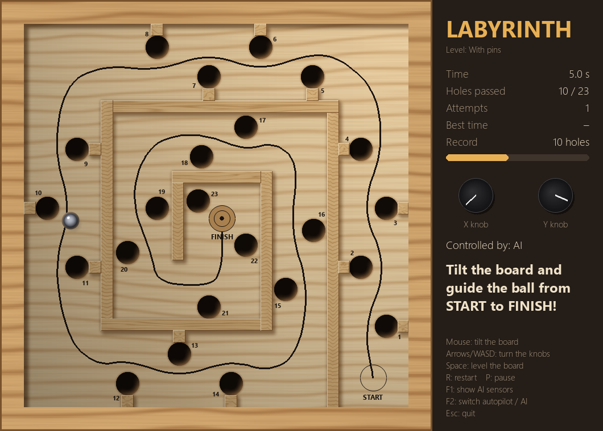
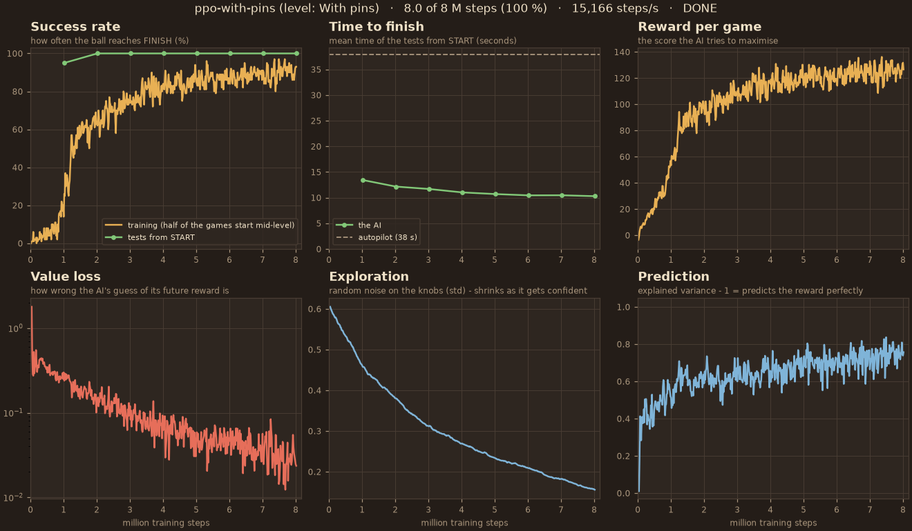

# Labyrint AI

A digital version of the classic wooden tilt maze from the 70s and 80s. You tilt the board
with two knobs and try to guide the steel ball from **START** to **FINISH** without it
dropping into any of the 23 numbered holes.



The game is built so that a neural network can learn to play it: the physics engine runs
without any graphics (about 700 times faster than real time) and comes with a ready-made
[Gymnasium](https://gymnasium.farama.org/) API, the standard interface for reinforcement learning.

## Getting started

```powershell
# once: create the environment (Python 3.12) and install the dependencies
py -3.12 -m venv .venv
.venv\Scripts\python -m pip install -r requirements.txt

# play
.venv\Scripts\python play.py --lang en                # play yourself (the UI is Swedish without --lang en)
.venv\Scripts\python play.py --lang en --level pinnar # the harder level with pins along the edges
.venv\Scripts\python play.py --lang en --a            # watch the built-in autopilot
.venv\Scripts\python play.py --lang en --ai           # watch the trained AI (or double-click spela_ai.bat)
```

Always run with `.venv\Scripts\python`: plain `python` does not have pygame installed.

| Control | Action |
|---|---|
| Mouse | Tilt the board (the mouse's distance from the centre = tilt) |
| Arrows / WASD | Turn the knobs (the tilt stays when you let go, like the real thing) |
| Space | Level the board |
| R | Restart |
| P | Pause |
| F1 | Show what the AI "sees" (its sensors) |
| F2 | Switch mouse → autopilot → AI |
| Esc | Quit |

## Project layout

```
labyrint/
  geometry.py      walls (rotatable rectangles), the black guide line (Path), spatial grid
  level.py         loads and validates levels from levels/*.json
  levels/          the levels: classic.json and pinnar.json
  game.py          the physics engine - LabyrinthGame (no graphics!)
  render.py        pygame graphics (only reads the game, never changes it)
  lang.py          UI text in Swedish and English
  autopilot.py     hand-written controller that follows the line - the benchmark for the AI
  env.py           the Gymnasium environment "Labyrint-v0" - the AI's API
  agent.py         lets a trained model control the game (NeuralPilot)
  vecenv.py        runs many environments per process - faster training
models/            a trained AI (labyrint_ai.zip)
docs/              the pictures in this README
play.py            play the game
train.py           train the AI
dashboard.py       live graphs of a training run
spela_ai.bat       double-click: watch the trained AI ("spela" = play)
trana_ai_live.bat  double-click: train a new AI and watch it learn live ("träna" = train)
tests/             pytest
```

**Physics:** the ball rolls with a = 5/7 · g · sin(tilt) (a solid ball rolling without
slipping), at most 3° of tilt, the board turns at a limited speed (like the knobs), rolling
resistance, bounces off the walls, and a realistic hole rim: once the ball's centre passes
the rim, it tips in towards the hole. A fast ball can skid past a hole, a slow one drops in.

## Levels

| Level | Description |
|---|---|
| `classic` | The first level: 23 holes, a spiral in towards FINISH. |
| `pinnar` | The same level with 14 small pins along the edges, like on the wooden original ("pinnar" = pins). |

On `classic` the holes along the edges sit 15–16 mm from the frame or wall. That leaves a
1–2 mm channel where the ball can roll along the edge past the hole without falling in, and
that is exactly how the trained AI sneaked around the level in 7 s. On `pinnar` a pin sits
between each of those holes and the edge, which closes the channel: the ball has to go
around the hole on the side of the line. In a random test, 0 of 14,000 attempts to sneak
past the holes on the edge side got through, compared with more than half on `classic`.

The AI still learns the level quickly, but it has to slalom around the holes instead of
sneaking past them: a test run finished 100 % of its games from START after 2 M steps
(about 2 minutes) and got down to 10.3 s after 8 M steps (about 9 minutes), compared with
7 s on `classic`.

The model in `models/` was trained on `classic`.

## API for the AI

### Directly against the engine

```python
from labyrint import LabyrinthGame, Status

game = LabyrinthGame("classic")
game.reset()                         # or reset(start_s=500) to start halfway along the line
while game.status is Status.RUNNING:
    game.step((0.2, -0.8))           # target tilt x, y in [-1, 1]; one step = 1/60 s
print(game.state)                    # GameState: position, velocity, tilt, progress, holes ...

snapshot = game.clone()              # cheap copy - for search/planning
```

### Gymnasium (for training)

```python
import gymnasium as gym
import labyrint                      # registers "Labyrint-v0"

env = gym.make("Labyrint-v0", render_mode="human")   # or None when training
obs, info = env.reset(seed=0)
obs, reward, terminated, truncated, info = env.step(env.action_space.sample())
```

- **Action:** 2 numbers in [-1, 1], the board's target tilt (x, y), 30 decisions per second.
- **Observation:** 36 numbers in [-1, 1]: the ball's position and velocity, the tilt, the line
  15/40/80 mm ahead, the line's direction and the distance to it, the 4 nearest holes,
  the distance to walls in 8 directions and how far along the level the ball is.
  (Press F1 in the game to see them.)
- **Reward:** +0.1 per mm forward along the line (backwards is negative), −5 for a hole,
  +50 for the finish, −0.01 per step. Adjustable through `RewardConfig`.
- **No parking:** if the ball stands still (no new progress for 10 s, `stall_seconds`), it
  counts as a fall. Without that rule the AI learned to hide the ball in a corner instead of
  daring to pass the next hole.
- **Curriculum:** `random_start=0.5` starts half of the games at a random point along the
  line, so the AI gets to practise the end of the level early.
- **Pixels:** `render_mode="rgb_array"` returns the board as an image, for training on pixels (CNN) later.

## Benchmark

```powershell
.venv\Scripts\python -m labyrint.autopilot --episodes 20
```

The hand-written autopilot finishes both levels in about 38 s (add `--level pinnar`).
The trained AI (`models/labyrint_ai.zip`) finishes `classic` in about 7 s: instead of
following the line it rides along the walls and passes the holes on the outside. On
`pinnar` it gets stuck against the pin at hole 2.

```powershell
.venv\Scripts\python -m labyrint.agent --episodes 100 --jitter 5   # measure the AI: 99 % finish
```

## Training the AI

```powershell
# once: torch (with CUDA), stable-baselines3 and friends
.venv\Scripts\python -m pip install torch --index-url https://download.pytorch.org/whl/cu128
.venv\Scripts\python -m pip install -r requirements-ai.txt

.venv\Scripts\python train.py --name ppo --level pinnar   # about 35 min for 30 M steps -> runs/ppo/best_model.zip
```

### Watch the AI train live

Double-click **`trana_ai_live.bat`**. It starts a new training run on the level with pins and
opens two windows:

- **The game** (`play.py --live`): the AI plays with its *latest* brain. The training saves a
  snapshot every 3 seconds and every new attempt uses the newest one, so you can watch the
  ball go from dropping straight into a hole to finishing the whole level (after about 2–3 minutes).
- **The graphs** (`dashboard.py`): success rate, time to finish compared with the autopilot,
  reward, value loss, how much it still explores, and how well it predicts its reward.



The training itself plays 64 games at once, about 500 times faster than real time, so what
you see in the game window is not the training games but a test of the latest version.
Close the training window (the black one) to stop it. The other two can be closed and
reopened at any time:

```powershell
.venv\Scripts\python play.py --live --lang en      # follow the newest run in runs/
.venv\Scripts\python dashboard.py --lang en
.venv\Scripts\python dashboard.py runs/ppo --lang en --save training.png   # save the graphs as a picture
```

To train on the old level: `trana_ai_live.bat --level classic`. The game, the graphs and
`play.py --ai runs/<name>/best_model.zip` work out which level a run trained on by themselves
(from `runs/<name>/args.json`). The windows the batch file opens use Swedish; start them
yourself with `--lang en` for English.

## Tests

```powershell
.venv\Scripts\python -m pytest
```

## Next steps

1. Pick the best model from tests with a larger start spread. Right now the fastest model wins, not the most reliable one.
2. More and harder levels; train an AI that can play levels it has never seen.
3. Train on pixels (`render_mode="rgb_array"`) instead of sensor values.
